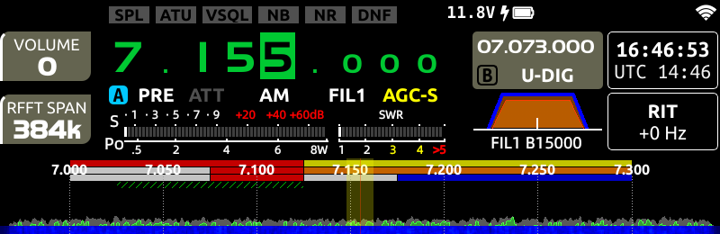
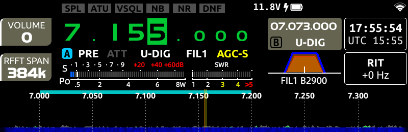

# Xiegu X6200: Replacing the US-license-class band-scope overlay with a CEPT/IARU-Region-1 band-edge display

## Overview

The colored bar drawn above the waterfall/spectrum view (the "amateur band operation & mode
allocation diagram" from the official manual) encodes **US FCC license class privileges**
(Extra / Advanced / General / Novice-Technician), not a country-specific band plan. For any
operator licensed under a CEPT/IARU Region 1 administration (i.e. basically everyone outside
the US), this display is at best decorative and at worst misleading.

This writeup documents:

1. How the relevant code was located and understood via static analysis of the shipped
   `x6200_ui_v100` binary (no source available, no vendor SDK involved).
2. The exact data structures and a channel-mixup bug in the color rendering path.
3. A binary patch that replaces the 4-layer US-license overlay with a single clean bar per
   band showing the actual legal edges for a CEPT/IARU-R1-style band plan, with everything
   outside that range rendered invisible (matching the background).
4. A ready-to-run patch script and step-by-step deployment instructions.

Tested on: X6200 UI app version **1.0.7**, MD5 of the unmodified
`/usr/app_qt/x6200_ui_v100` = `a08ab13189bececa9995d3d19bc14c94`. The patch script refuses
to run against any other file (see "Version matching" below) — it will not silently corrupt
a different build.

Everything below assumes you already have root SSH access to your X6200 (see
[Get Rooted](../Get%20Rooted/README.md) elsewhere in this repo). Getting that access is
**out of scope** for this writeup.

**This only changes the on-screen display.** It does not touch `isTxEnable()` / `isHamBand()`
or the `fullband-tx` setting in `/etc/xgradio/xgradio.conf` — TX behavior of the radio is
completely unaffected by this patch.

Before (stock, 40 m band, VFO at 7.155 MHz) vs. after (patched, same VFO position) — both
grabbed as pixel-exact on-device screenshots, see the methodology section for how:

| Before | After |
|---|---|
|  |  |

---

## Background: what is this bar, actually?

At first glance the colored bar under the frequency ticks looks like a country-specific band
plan (CW / data / phone segments). Comparing it against a real national band plan (in this
case the Austrian ÖVSV chart) it clearly didn't line up — segment boundaries didn't match,
and colors that should have been consistent across bands weren't.

The official X6200 manual has a section titled *"Amateur band operation & mode allocation
diagram display area"* that clears this up. Quoting it directly:

> There are 3 color bars and 1 diagonal color bar from top to bottom in this area,
> represented by E, A, G and \* respectively:
> E: Extra, A: Advanced, G: General, \*: Novice and Technician
>
> Bright yellow: Extra operator (voice/CW/image) · Orange: Advanced · Blue: General ·
> Red: CW/RTTY/DATA · Green slash: Novice/Technician CW · Blue slash: Novice/Technician voice
> · Blank area: no permission
>
> [...] the operation level of some countries or regions, pattern planning there may be a
> discrepancy, the local actual laws and regulations shall prevail.

So this is a **direct port of the US amateur radio license-class system**, and the manual
itself disclaims it for other regulatory regimes. Since CEPT/IARU Region 1 licenses are not
tiered this way (a HAREC-based license simply gets the whole national allocation, with
CW/data/phone sub-segments recommended by IARU rather than tied to a license class), the
whole 4-layer E/A/G/\* mechanism is simply the wrong model — there's nothing to "fix" data-wise
for a single license class, we just want **one bar showing the legal edges**, ideally further
subdivided by mode (CW/data/phone) later on.

---

## Methodology

No source code, SDK, or debug symbols were available — everything below was derived from the
shipped ARM32 binary via static analysis, cross-checked against the running device.

Tools used:
- `radare2` (`aa`, `pdf`, `pdc`) for disassembly / light decompilation of `x6200_ui_v100`
  (a Qt5 application, statically linked against a private Qt build, ARMv7, ELF, one
  `PT_LOAD` segment).
- Root SSH + SSHFS to the device for reading files and deploying test binaries.
- A **pixel-perfect on-device screenshot** technique (see below) to verify hypotheses against
  ground truth — this turned out to be essential, since interpreting compressed phone photos
  of the LCD led to wrong conclusions early on (perceived "blue" and "green hatching" that
  turned out to be camera/LCD viewing-angle artifacts, not real pixels).

### Getting a real screenshot

The device does **not** use the legacy fbdev interface for the UI (`/dev/fb0` stays at all
zero bytes — it's only the kernel's `fbcon` compatibility buffer, unused). The Qt app talks to
DRM (`sun4i-drm`) directly via its own "dumb buffers". You can see this via debugfs:

```sh
mount -t debugfs none /sys/kernel/debug   # if not already mounted
cat /sys/kernel/debug/dri/1/framebuffer   # lists framebuffers allocated by x6200_ui_v100
cat /sys/kernel/debug/dri/1/state         # shows which fb id is currently bound to plane-0
```

Reading raw physical memory (`/dev/mem`) at the reported buffer address is blocked by
`CONFIG_STRICT_DEVMEM`. Instead, use the DRM API itself from a small Python script running on
the device (`python3` is present in the Buildroot image):

```python
# grab_frame.py <fb_id> </dev/dri/cardN>  ->  writes /tmp/drm_frame.raw (BGRX8888, 480x800)
import fcntl, struct, mmap, sys
def IOC(d,t,nr,size): return (d<<30)|(size<<16)|(t<<8)|nr
fd = open(sys.argv[2], "r+b", buffering=0)
GETFB = IOC(3, ord('d'), 0xAD, 28)     # struct drm_mode_fb_cmd
buf = bytearray(struct.pack("IIIIIII", int(sys.argv[1]), 0,0,0,0,0,0))
fcntl.ioctl(fd, GETFB, buf, True)
fb_id, w, h, pitch, bpp, depth, handle = struct.unpack("IIIIIII", buf)
MAPDUMB = IOC(3, ord('d'), 0xB3, 16)   # struct drm_mode_map_dumb
buf2 = bytearray(struct.pack("IIQ", handle, 0, 0))
fcntl.ioctl(fd, MAPDUMB, buf2, True)
_, _, off = struct.unpack("IIQ", buf2)
m = mmap.mmap(fd.fileno(), pitch*h, mmap.MAP_SHARED, mmap.PROT_READ, offset=off)
open("/tmp/drm_frame.raw","wb").write(m.read(pitch*h))
```

Pull `/tmp/drm_frame.raw` off the device, load as raw `BGRA8888` at 480x800, rotate 90°
(the panel is mounted rotated relative to the framebuffer's native orientation — see
`fbcon=rotate:3` on the kernel cmdline). This gives an exact, artifact-free image of what's
on screen — much more reliable than a phone photo for reading off pixel colors or measuring
where a color transition sits relative to the frequency ticks.

### Iterative patch/verify loop

The rest of the investigation was: form a hypothesis from static analysis, apply a minimal
binary patch to a copy of the file, deploy it (see "Safety" below), grab a real screenshot,
compare against the hypothesis, repeat. This caught several wrong assumptions quickly (see
"the channel-mixup bug" below, which was only found because the *measured* on-screen RGB
values didn't match what the color table's raw bytes implied).

---

## Technical findings

### Where the band data lives

`XBandPlan::XBandPlan()` (the constructor) is one large function (~3800 ARM instructions)
that builds 33 `XBandMapItem` entries, each hardcoded inline — there is no external data file,
database, or config for this (a `bands-cfg` setting exists in `/etc/xgradio/xgradio.conf` and
is *read*, but no code path anywhere in the binary ever consumes the value again — dead code,
presumably shared with a related product line).

Each `XBandMapItem` carries up to **4 separate `QList<XBandRegionMap>`** — one list per
E/A/G/\* row. Each `XBandRegionMap` entry is essentially `{ XBandEdge{low, high}, uint8_t
color }`. These are the low-level building blocks; the manual's 4 stacked bars are just 4 of
these lists drawn on top of each other.

### Where the drawing happens

`XBandScope::paintEvent()` calls `XBandScope::drawRegionMap(QPainter&, XBandRegionMap const&,
int row, Qt::BrushStyle)` **four times per visible band**, once per list, in this order:

| list offset (in `XBandMapItem`) | `row` arg | brush style |
|---|---|---|
| `+0x60` | 0 | `Qt::SolidPattern` |
| `+0x68` | 1 | `Qt::SolidPattern` |
| `+0x64` | 2 | `Qt::SolidPattern` |
| `+0x6c` | 3 | `Qt::BDiagPattern` (the hatched "Novice/Technician" row) |

`drawRegionMap()` itself calls `XBandPlan::regionMapColor(unsigned char index)` — a tiny
(36-byte) function: bounds-check `index <= 6`, then a straight array lookup into a 7-entry
`uint32_t` (ARGB) table; out-of-range falls back to a hardcoded red. The table lives at a
single fixed address and is otherwise unused elsewhere, so it's a very clean, low-risk patch
target.

### The channel-mixup bug

Reading the table's raw bytes suggested colors like *black*, *dark red*, *transparent green*
— but the actual on-screen colors (verified via the DRM screenshot method) were *yellow*,
*orange*, *blue*, *white/gray*. These didn't match until the **caller** of
`regionMapColor()` was inspected closely:

```
r0 = regionMapColor(table_index)          ; r0 = 0xAARRGGBB (table entry)
r1 = (r0 >> 24) & 0xFF                     ; table's Alpha byte
r2 = (r0 >> 16) & 0xFF                     ; table's Red byte
r3 = (r0 >> 8)  & 0xFF                     ; table's Green byte
QColor::setRgb(this, r1, r2, r3, 0xC3)     ; setRgb(int r, int g, int b, int a)
```

`QColor::setRgb(r, g, b, a)` is being called with the table's **Alpha** byte in the *red*
argument slot, the table's **Red** byte in the *green* slot, and the table's **Green** byte in
the *blue* slot. The table's own Blue byte is never read, and the displayed alpha is a
hardcoded constant (`0xC3` ≈ 76% opacity) regardless of what the table says — so an entry
that looks "fully transparent" by its stored alpha byte is **not** actually invisible on
screen.

Net effect — the *real* displayed color per table index:

| index | table bytes (A,R,G,B) | **displayed** RGB |
|---|---|---|
| 0 | `FF,FF,00,00` | Yellow `(255,255,0)` |
| 1 | `FF,7F,00,00` | Orange `(255,127,0)` |
| 2 | `00,00,FF,00` | Blue `(0,0,255)` |
| 3 | `FF,00,00,00` | Red `(255,0,0)` |
| 4 | `FF,00,FF,00` | Magenta `(255,0,255)` (unused by any shipped band, as far as tested) |
| 5 | `00,FF,00,00` | Green `(0,255,0)` |
| 6 | `FF,FF,FF,00` | White/gray `(255,255,255)` — the "no permission" blank areas |

This table is exactly what the manual's legend maps to once you know the mixup: 0=Extra
(yellow), 1=Advanced (orange), 2=General (blue), 3=CW/data (red), 5=Novice/Tech CW (green,
normally drawn hatched), 6=blank/no-permission (white/gray, blended at ~76% opacity over the
dark background — reads visually as a neutral gray strip).

### ELF layout note

Everything above is addressed as **virtual address (vaddr)**. The binary has a single
`PT_LOAD` segment mapped at vaddr `0x10000` with file offset `0`, so:

```
file_offset = vaddr - 0x10000
```

for every address referenced in this document and in the patch script.

---

## The patch

Two independent techniques, applied together:

### 1. Hide 3 of the 4 rows (one global code patch)

Since we don't want a 4-layer license-class breakdown, the simplest and lowest-risk fix is to
stop 3 of the 4 `drawRegionMap()` calls inside `paintEvent()` from happening at all, by
overwriting the `bl` (branch-and-link) instruction with an ARM NOP (`mov r0, r0` /
`0xE1A00000`). This is a **single patch that applies to every band uniformly** — nothing
band-specific about it. The surrounding loop (list iteration, bounds check) still executes
harmlessly; only the actual paint call is skipped.

We kept `row 0` (list `+0x60`, `Qt::SolidPattern`) as the one visible row, since for the
bands we examined it turned out to hold the simplest data (a small number of full-range
entries, easiest to re-target).

### 2. Re-target the color table + per-band edges

- Global color table: index 3 → cyan (displayed), index 6 → black (i.e. blends into the
  background instead of showing gray "no permission"). This makes any surviving entry that
  used to say "CW/data" (red) show as our new "in-band" cyan, and anything colored "blank"
  render as invisible.
- Per band, in the kept list (`+0x60`): either
  - the list has **one entry** spanning the band's low/high edge — just overwrite the two
    edge literals directly to your country's/region's legal low/high (this was possible for
    6 of the 11 HF bands we did, since the shipped edges already matched an existing entry
    boundary, or a single entry covered the whole international allocation and just needed
    recoloring), or
  - the list has **two entries** (e.g. a "CW/data" sub-segment then a "phone" sub-segment,
    matching how the binary's original, wider international edge was subdivided) — if your
    target upper/lower edge falls *inside* the international range, you can usually just move
    the *boundary between the two entries* to your target edge and recolor the second entry
    to the "invisible" index (6) — this changes both "end of segment 1" and "start of segment
    2" with a single 4-byte literal patch, because the disassembly re-uses `boundary + 1` as
    the second entry's start.
  - A few bands (6m in our case) build up many small entries via chained `add` instructions
    instead of clean literal loads — more tedious to trace individually, but since our target
    range matched the *existing* overall international edges exactly, we just forced **every**
    color-selecting instruction in that band's chain to the "cyan" index, regardless of
    original value — no edge literals needed changing at all.

Every affected instruction, and how it was located, is documented inline in
[`apply_bandplan_patch.py`](./apply_bandplan_patch.py).

### Example results tested against real hardware (Austria / ÖVSV band plan)

The ÖVSV band plan follows the IARU Region 1 recommendations closely for the segments below;
if your national permissions differ (most likely: 60 m, and the exact top edge of 160 m/80 m,
which vary significantly by country/administration), edit the corresponding line(s) in the
patch script before running it. Everything here was verified visually on the actual device
after patching:

| Band | Shipped (US-plan) overall edges | Patched to | Notes |
|---|---|---|---|
| 160 m | 1.800 – 2.000 MHz | 1.810 – 1.950 MHz | single entry, edges + color patched |
| 80 m | 3.500 – 4.000 MHz (3 segments) | 3.500 – 3.800 MHz | segment boundary already sat at 3.800 (75 m broadcast split) — only recolored |
| 60 m | 5.332 – 5.405 MHz | 5.250 – 5.450 MHz | single entry, edges + color patched — **check your own administration's 60 m allocation, this varies enormously by country** |
| 40 m | 7.000 – 7.300 MHz (2 segments) | 7.000 – 7.200 MHz | boundary moved from 7.125 → 7.200 |
| 30 m | 10.100 – 10.150 MHz | unchanged | single entry, already matched — recolor only |
| 20 m | 14.000 – 14.350 MHz | unchanged | 2 segments, already matched — recolor only |
| 17 m | 18.068 – 18.168 MHz | unchanged | 2 segments, already matched — recolor only |
| 15 m | 21.000 – 21.450 MHz | unchanged | 2 segments, already matched — recolor only |
| 12 m | 24.890 – 24.990 MHz | unchanged | 2 segments, already matched — recolor only |
| 10 m | 28.000 – 29.700 MHz | unchanged | 2 segments, already matched — recolor only |
| 6 m | 50.000 – 54.000 MHz | unchanged | many segments, already matched — recolor only (7 instructions) |

---

## Applying it yourself

### Version matching (read this first)

The patch targets **exact byte offsets** in one specific compiled binary. Before doing
anything, confirm your file matches ours:

```sh
ssh <your-x6200> "md5sum /usr/app_qt/x6200_ui_v100"
# must print: a08ab13189bececa9995d3d19bc14c94
```

If it doesn't match — even if your app also reports version "1.0.7" — **do not proceed**.
[`apply_bandplan_patch.py`](./apply_bandplan_patch.py) checks this itself and refuses to
write anything if the hash differs, but it's worth knowing up front rather than discovering
it after copying files around.

### Steps

```sh
# 1. Pull the current binary off the device
scp <your-x6200>:/usr/app_qt/x6200_ui_v100 ./original

# 2. Run the patcher (aborts safely on any mismatch, edit the band-edge
#    constants at the top of the script first if your country differs
#    from the Austrian reference values above)
python3 apply_bandplan_patch.py ./original ./patched

# 3. Back up the original ON the device (do not skip this)
ssh <your-x6200> "cp /usr/app_qt/x6200_ui_v100 /usr/app_qt/x6200_ui_v100.bak_original"

# 4. Upload and install the patched binary
scp ./patched <your-x6200>:/usr/app_qt/x6200_ui_v100.new
ssh <your-x6200> "chmod 755 /usr/app_qt/x6200_ui_v100.new && \
                   cp /usr/app_qt/x6200_ui_v100.new /usr/app_qt/x6200_ui_v100 && \
                   /usr/share/support/userapp restart"
```

Rollback at any time:

```sh
ssh <your-x6200> "cp /usr/app_qt/x6200_ui_v100.bak_original /usr/app_qt/x6200_ui_v100 && \
                   /usr/share/support/userapp restart"
```

### Safety notes

- The UI process is supervised by `monit` (`/etc/monitrc`), which restarts it automatically
  via `/usr/share/support/userapp` if it ever isn't running — a crash-looping patched binary
  is annoying but not fatal, and doesn't affect SSH (a separate service).
- No code signing / secure boot / `dm-verity` was found on this device (plain Buildroot
  2020.02.9 root filesystem) — a bad binary won't be rejected at exec time, but it also won't
  survive undetected; the app will simply fail to start or crash, and you restore from backup.
- This is entirely unofficial, unsupported, and could be overwritten (harmlessly) by a future
  official firmware update, or could fail to apply if a future update changes this binary's
  layout (in which case the offsets in this document are no longer valid and a fresh analysis
  pass is needed).

---

## Ideas for follow-up work

- ~~Proper CW/data/phone sub-segmentation per band (matching the IARU Region 1 recommended band
  plan colors, e.g. light blue = CW, yellow = phone, green = data, red = beacons) instead of one
  flat "in-band" color — the 4-list structure already supports this, it would just need the
  remaining 3 rows re-populated instead of hidden, plus a consistent color convention across
  bands.~~ **Done** — see the [Bandplan Subdivision Patch](../Bandplan%20Subdivision%20Patch/README.md)
  in this repo for a full per-band CW/DATA/BAKEN/Voice breakdown built on top of this patch's
  groundwork (same NOP + color-table technique, taken further). It's a drop-in replacement for
  this script, not an addition — apply one or the other, not both. That writeup also covers two
  complications this one didn't run into: literals shared between multiple region-map entries,
  and boundaries computed at runtime via short `add`/`sub` immediate chains rather than loaded
  from the literal pool.
- An external config mechanism (the unused `bands-cfg` setting hints the vendor may have
  intended something like this for a related product) so this doesn't require a fresh binary
  patch per person/country. Still open — now more valuable given the Subdivision Patch's larger
  number of country-specific edge choices.
- A cleaner reverse-engineering pass with Ghidra instead of `radare2`'s built-in
  decompiler — several of the harder bands (6 m in particular) build frequency literals via
  chains of register arithmetic that a real decompiler would likely resolve automatically
  instead of requiring manual/simulated tracing. Still open; the Subdivision Patch worked around
  this with a bespoke ESIL-emulation register tracer instead.
