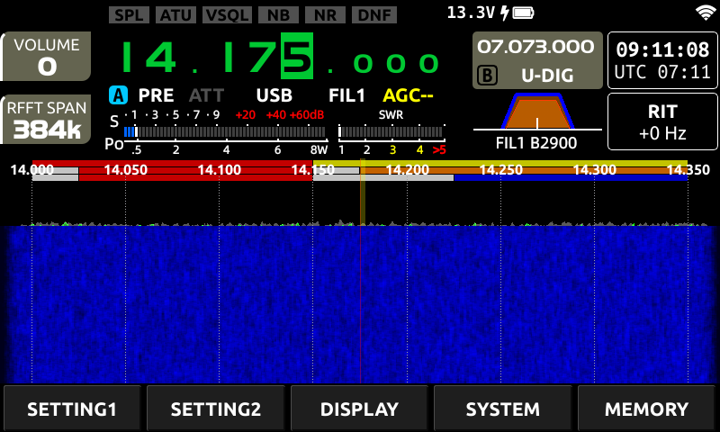
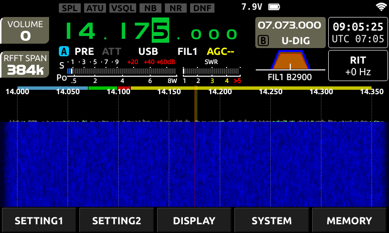

# Xiegu X6200: CW / DATA / BAKEN / Voice sub-band breakdown in the band-scope bar

## Overview

The [Bandplan Display Patch](../Bandplan%20Display%20Patch/README.md) one directory up replaces
the stock US-license-class overlay with a single flat "in-band" color per band. That's correct,
but it throws away information every national IARU Region 1 band plan actually carries: which
part of the band is CW, which is data, which is phone, and where the beacon sub-bands sit.

This writeup documents a follow-up patch that goes further: **a real per-band CW / DATA / BAKEN
/ Voice color breakdown, entirely without inserting any new code.** The device already carries up
to 4 separate region-map lists per band (that's exactly what the original 4-layer US-license
overlay draws), 3 of which the display patch above simply hides. Instead of hiding them, this
patch re-enables and repurposes them: their edges and colors are patched to the target national
band plan's sub-segments, and they're merged into the one row that's always drawn, so a band's
full mode breakdown shows up as a single, readable bar instead of several stacked/overlapping
rows.

This writeup documents:

1. How much detail is actually recoverable per band without inserting new instructions (it
   varies a lot -- some bands get the full 4-segment breakdown, some only a partial fix, a
   couple are structurally stuck at one flat color).
2. The two harder technical problems this ran into that the base display patch didn't: literals
   that are shared between several region-map entries (so patching one moves several at once,
   for better or worse), and boundaries that aren't literal-pool constants at all but are
   computed at runtime via short chains of `add`/`sub` immediates -- which also means not every
   arbitrary target Hz value is reachable, because ARM's "modified immediate" instruction
   encoding can't represent every 32-bit delta directly.
3. A ready-to-run patch script (a superset of, and drop-in replacement for, the base display
   patch's script) and the same deployment process.

Tested on: X6200 UI app version **1.0.7**, MD5 of the unmodified `/usr/app_qt/x6200_ui_v100` =
`a08ab13189bececa9995d3d19bc14c94` -- same target binary as the base display patch. The script
refuses to run against any other file.

This only changes the on-screen display, same as the base patch -- `isTxEnable()` / `isHamBand()`
and the `fullband-tx` setting in `/etc/xgradio/xgradio.conf` are untouched.

Before (stock US-license-class overlay, 20 m band, VFO at 14.175 MHz) vs. after (patched, same
VFO position and RFFT span — all 4 segment colors visible on this band: CW, DATA, BAKEN, Voice) —
both grabbed as pixel-exact on-device screenshots, same technique as the base patch's writeup:

| Before | After |
|---|---|
|  |  |

---

## Background: how much detail can actually be recovered?

Every national band plan we compared (Austrian ÖVSV, which follows IARU Region 1 closely) breaks
most HF bands into a handful of sub-segments: a CW-only portion at the low end, a data segment, a
beacon sub-band on some bands, and a phone/voice segment covering the rest. The base display
patch deliberately doesn't attempt this — it hides 3 of the device's 4 region-map rows entirely
and shows one flat color, because reconstructing the *right* per-band split without inserting new
code isn't guaranteed to be possible for every band, and turned out to need real per-band
reverse-engineering effort to find out either way.

It turns out the honest answer is "it depends on the band": some bands have plenty of spare,
independently-editable region-map entries once you look at all 4 rows instead of just row 0; a
few have only one boundary anywhere in the whole band no matter how many rows you check; and one
(160m) can't be split at all because its entries don't just share a literal value, they share the
same CPU register at runtime.

---

## Methodology

Same tools and general approach as the base display patch (`radare2` disassembly, root SSH +
SSHFS, the pixel-perfect on-device DRM screenshot technique documented in that writeup's
"Methodology" section — not repeated here). This patch needed two additional techniques on top of
that, both because the region-map structure turned out to be more entangled than a first glance
at row 0 suggests.

### ESIL emulation instead of static reading

Reading literal values directly out of the binary works for isolated, independent entries, but
several bands turned out to share a literal *address* between multiple region-map entries — so a
static reader can't tell "entry A's high edge" and "entry B's low edge" apart if they're the same
32-bit word at the same address (this is often intentional on the vendor's part: a boundary is
naturally `entry A's high + 1 == entry B's low`, encoded as literally the same stored value read
twice). The fix was to emulate the whole `XBandPlan()` constructor with `radare2`'s ESIL
interpreter and log every literal-pool load with its destination register, the constructor call
it eventually feeds, and the resulting `(low, high, color)` triple — turning "which address is
this" into "which region-map entry's field is this, concretely". A couple of loads use a
`ldrd rY, rZ, [rX]` pair-load through a register computed a few instructions earlier via
`add rX, pc, N` rather than a direct `ldr rX, [0x...]`; a plain disassembly-regex literal scanner
misses these because the operand shows as a register, not a resolved address, so the emulator
additionally tracks pending `add rX, pc, N` targets and resolves the pair-load's real literal
address from that.

### Register-value chains and the ARM modified-immediate constraint

A few bands (20m, 15m, 6m) don't load a boundary from the literal pool at all past a certain
point — the compiler instead computes it at runtime as `some_register += SMALL_IMMEDIATE` in one
or two steps off an earlier boundary's value, because the two values happen to differ by a round
number the compiler could express more cheaply as arithmetic than as a second literal-pool word.
The general shape (a short `add`/`sub` chain, typically 1-2 hops) was the same technique that
unblocked 20m's supposedly "opaque" boundaries in an earlier pass at this problem — what looked
like unrelated runtime arithmetic turned out to be a completely ordinary, individually-traceable
and individually-patchable chain once watched hop-by-hop with a live register read before and
after each instruction (not just inferred from the disassembly text, which occasionally displays
an immediate as a coincidentally-matching symbol name instead of a hex literal — see 6m's `README`
section below for a worked example of exactly that).

The complication chains add: **ARM32's data-processing "modified immediate" operand2 encoding
can't represent every 32-bit value.** It's an 8-bit value rotated right by an even number of bit
positions (0-30) — roughly speaking, an 8-bit quantity that can be shifted into place, not an
arbitrary 32-bit number. Retargeting a chain hop to a new delta therefore isn't just arithmetic —
each new immediate has to be checked for whether it's representable at all, and a delta that isn't
representable in one instruction has to be split across the 2 (or occasionally more) hops that
happen to exist in the native chain, choosing a split point where *both* halves are valid
encodings. 6m's Voice/AllMode segment hit this directly: two of the required jumps are each
exactly 1,500,000 Hz, and 1,500,000 turns out to have **no valid 2-instruction decomposition at
all** (verified by exhaustively enumerating every representable value up to a few million and
checking pairwise sums) — solved by widening the affected segment from 1 native slot to 2
(rendering as one seamless block, since both get the same color), which turns each 1,500,000 Hz
jump into a 4-instruction hop with a decomposition that *does* exist (750,000 + 750,000, each
further split as 432 + 749,568). See the small immediate-decomposition helper referenced in the
patch script's header comment if you need to retarget a chain patch for your own country's band
plan.

Every new chain immediate was re-disassembled after patching (not just computed on paper) to
confirm it decodes to the *exact* intended value before being trusted, and every band's full
region-map trace was re-run after patching and diffed against the pre-patch trace to confirm
**only the intended band's entries changed** — chains that share a literal further upstream (like
20m's and 15m's) make it easy to accidentally shift something you didn't mean to touch.

---

## Technical findings

### The region-map structure, and the "redirect" technique

See the base display patch's "Where the band data lives" / "Where the drawing happens" sections
for the full structural background (`XBandMapItem`, its 4 `QList<XBandRegionMap>` lists, and
`XBandScope::drawRegionMap()`'s 4 calls per band). The key extra fact this patch relies on: each
region-map entry is appended to its list via an `add r0, BASE, OFFSET` instruction just before the
`QList::append()` call, where `OFFSET` selects *which* of the 4 lists (`+0x34`=row0, `+0x38`=row1,
`+0x3c`=row2, `+0x40`=row3) the entry lands in. Flipping a single immediate byte in that one
instruction moves the entry into a *different* list — in particular, into row0, the one row
`paintEvent()` always draws — without touching the entry's own edge/color fields or moving any
code around. This "redirect" is how most of the extra segments below were recovered: they already
existed natively as row1 (or, for 10m, row3) entries, just never drawn because those rows are
normally hidden.

A "row" (list) in this device is not limited to a single color — it's an ordinary `QList`, so
row0 alone can carry an arbitrary number of differently-colored, differently-edged segments once
enough entries are redirected into it. That's what makes a full 4-segment breakdown fit in a
*single* visible row rather than needing several stacked/overlapping rows (an earlier version of
this patch tried a 2-row split for some bands — one merged summary color in row0, full detail in
row1 underneath — but a stacked reading turned out to look like conflicting information rather
than added detail, so every band that gets a full breakdown here has it entirely within row0).

### Per-band literal maps, chains, and constraints

Full address-level detail — literal-pool addresses, which fields share a literal, exact chain
immediates and how each was derived — is documented inline in
[`apply_bandplan_subdivision_patch.py`](./apply_bandplan_subdivision_patch.py), organized by band in the same order as the
results table below. The comments there are the authoritative reference if you're adapting this
to a different national band plan or verifying the analysis yourself.

### Color table convention

Reusing the base patch's color table (see that writeup for the channel-mixup bug that governs how
the raw table bytes map to displayed RGB), with one additional index repainted and every index
given a consistent cross-band meaning:

| index | displayed RGB | meaning |
|---|---|---|
| 0 | Yellow `(255,255,0)` | Voice / Phone |
| 1 | mint/spring green `(0,255,170)` | anything that isn't CW/DATA/BAKEN/Voice (6m's R&D allocation only) |
| 2 | light blue `(100,200,255)` | CW |
| 3 | Red `(255,0,0)` | BAKEN (beacons) |
| 4 | Gray `(160,160,160)` | merged/mixed zone — a band where the true mode boundaries aren't independently recoverable, so this signals "not a single mode" rather than showing a misleadingly specific color |
| 5 | Green `(0,255,0)` | DATA |
| 6 | black (blends into background) | blank / out-of-band |

Index 1 was repainted from the base patch's Orange to a mint/spring green: DATA (index 5) is
already maximum-saturation pure green, so 6m's R&D allocation (the only band that still shows
index 1 once every other native index-1 entry elsewhere is either neutralized or moved to index 0
below) needed a different *hue* to read as visually distinct from both DATA and neighbouring
Voice segments, not just a brighter shade of the same color.

---

## The patch

Applied directly to the clean stock binary (not layered on top of the base display patch's
output) — this script's global setup section re-does the base patch's row-2 NOP and color-table
groundwork itself, so it's a **drop-in replacement**, not an addition: apply one script or the
other, not both.

Per band, one of these techniques (or a combination) was used, roughly in increasing order of
effort:

1. **Recolor only.** A band already has the right edges natively, just the wrong color — one
   `mov r2, #N` immediate (or, where the color was set via a register copy rather than a direct
   immediate, the whole instruction replaced outright with a direct-immediate `mov`) patched per
   segment.
2. **Redirect + recolor + move an edge.** A hidden row (usually row1) already contains a
   genuinely independent, unused entry — redirected into row0, recolored, and its edge literal(s)
   moved to the target boundary.
3. **Chain patch.** A boundary is computed at runtime rather than loaded from the literal pool —
   the chain's immediate(s) are recomputed and, where necessary, redistributed across the
   available hops so every individual instruction stays a valid ARM modified immediate (see
   "Methodology" above).
4. **Segment-count compromise.** Where a band structurally has fewer independent boundaries than
   the target band plan needs (and inserting new code is out of scope for this patch), the
   achievable subset is applied and the merged/ambiguous portion is colored Gray (index 4) rather
   than a misleadingly specific mode color.

Every patched entry, and which of the above techniques applies, is documented per instruction in
[`apply_bandplan_subdivision_patch.py`](./apply_bandplan_subdivision_patch.py).

### Results

| Band | Segment | Edges | Color |
|---|---|---|---|
| 40m | CW | 7.000.000 – 7.039.999 Hz | light blue |
| 40m | DATA | 7.040.000 – 7.052.999 Hz | Green |
| 40m | Voice | 7.053.000 – 7.199.999 Hz | Yellow |
| 40m | *(no entry — true background)* | 7.200.000 – 7.300.000 Hz | black (uncovered) |
| 80m | CW | 3.500.000 – 3.569.999 Hz | light blue |
| 80m | DATA | 3.570.000 – 3.619.999 Hz | Green |
| 80m | Voice | 3.620.000 – 3.799.999 Hz | Yellow |
| 80m | blank (75m broadcast, non-ham) | 3.800.000 – 4.000.000 Hz | black |
| 20m | CW | 14.000.000 – 14.069.999 Hz | light blue |
| 20m | DATA | 14.070.000 – 14.098.999 Hz | Green |
| 20m | BAKEN | 14.099.000 – 14.111.999 Hz | Red |
| 20m | Voice | 14.112.000 – 14.350.000 Hz | Yellow |
| 15m | CW | 21.000.000 – 21.069.999 Hz | light blue |
| 15m | DATA | 21.070.000 – 21.148.999 Hz | Green |
| 15m | BAKEN | 21.149.000 – 21.150.999 Hz | Red |
| 15m | Voice | 21.151.000 – 21.450.000 Hz | Yellow |
| 17m | CW+DATA+BAKEN (merged, partial fix) | 18.068.000 – 18.119.999 Hz | Gray |
| 17m | Voice | 18.120.000 – 18.168.000 Hz | Yellow |
| 12m | CW+DATA+BAKEN (merged, partial fix) | 24.890.000 – 24.939.999 Hz | Gray |
| 12m | Voice | 24.940.000 – 24.990.000 Hz | Yellow |
| 10m | CW+DATA+BAKEN (merged, partial fix) | 28.000.000 – 28.224.999 Hz | Gray |
| 10m | Voice | 28.225.000 – 28.999.999 Hz | Yellow |
| 10m | SAT+transition+FM (merged) | 29.000.000 – 29.700.000 Hz | Gray |
| 30m | CW+DATA (merged, color-only fix) | 10.100.000 – 10.150.000 Hz | Gray |
| 60m | CW+all-modes+weak-signal (merged) | 5.351.500 – 5.366.500 Hz | Gray |
| 6m | BAKEN | 50.000.000 – 50.029.999 Hz | Red |
| 6m | CW | 50.030.000 – 50.099.999 Hz | light blue |
| 6m | Voice | 50.100.000 – 50.299.999 Hz | Yellow |
| 6m | DATA | 50.300.000 – 50.399.999 Hz | Green |
| 6m | BAKEN | 50.400.000 – 50.499.999 Hz | Red |
| 6m | Voice+AllMode (split across 2 seamless native segments) | 50.500.000 – 51.999.999 Hz | Yellow |
| 6m | R&D | 52.000.000 – 54.000.000 Hz | mint/spring green |
| 160m | *(structurally infeasible — see below)* | 1.800.000 – 2.000.000 Hz | Gray |

**160m is the one band left completely unsplit.** All 3 of its region-map entries (row0/row1/
row2) share not just a literal *address* but the exact same runtime *register value* for their
edges — there is no way to give them independently different edges without inserting new
instructions, which is out of scope for this patch. Its one visible entry is recolored from the
misleading native Yellow (would read as "Voice" in this file's convention) to Gray.

**A hard requirement that applied throughout, same as the base display patch:** a segment must
never imply usable spectrum beyond the true legal edge, even where a full mode breakdown isn't
achievable. This caught a real bug during development — 60m's single native entry's edges
(5,332,000-5,405,000 Hz) turned out not to correspond to *any* real national 60m allocation, wide
or narrow; comparing an on-device screenshot against the actual chart is what caught it (see the
inline comment in the patch script). If you retarget this patch for a different band plan, verify
edges against your source chart, not just against what the stock binary already contained.

---

## Applying it yourself

### Version matching (read this first)

Same requirement as the base display patch — confirm your file matches before doing anything:

```sh
ssh <your-x6200> "md5sum /usr/app_qt/x6200_ui_v100"
# must print: a08ab13189bececa9995d3d19bc14c94
```

[`apply_bandplan_subdivision_patch.py`](./apply_bandplan_subdivision_patch.py) checks this itself and refuses to write
anything if the hash differs.

### Steps

```sh
# 1. Pull the current binary off the device
scp <your-x6200>:/usr/app_qt/x6200_ui_v100 ./original

# 2. Run the patcher (aborts safely on any mismatch; if your country's band
#    plan differs from the Austrian/OeVSV reference values used here --
#    most likely for 60m, see the note in the "Results" table above --
#    edit the corresponding PATCHES entries first, see the module
#    docstring at the top of the script for guidance on which patches are
#    trivial to retarget vs. which need the chain-tracing methodology above)
python3 apply_bandplan_subdivision_patch.py ./original ./patched

# 3. Back up the original ON the device (do not skip this)
ssh <your-x6200> "cp /usr/app_qt/x6200_ui_v100 /usr/app_qt/x6200_ui_v100.bak_original"

# 4. Upload and install the patched binary
scp ./patched <your-x6200>:/usr/app_qt/x6200_ui_v100.new
ssh <your-x6200> "chmod 755 /usr/app_qt/x6200_ui_v100.new && \
                   cp /usr/app_qt/x6200_ui_v100.new /usr/app_qt/x6200_ui_v100 && \
                   /usr/share/support/userapp restart"
```

Rollback at any time:

```sh
ssh <your-x6200> "cp /usr/app_qt/x6200_ui_v100.bak_original /usr/app_qt/x6200_ui_v100 && \
                   /usr/share/support/userapp restart"
```

### Safety notes

Same as the base display patch — repeated here since this is a standalone entry point:

- The UI process is supervised by `monit` (`/etc/monitrc`), which restarts it automatically via
  `/usr/share/support/userapp` if it ever isn't running.
- No code signing / secure boot / `dm-verity` was found on this device (plain Buildroot root
  filesystem) — a bad binary simply fails to start or crashes; restore from your backup.
- Copying a file onto the device (`scp`, or a plain `cp` between two files already on the device)
  can drop the executable bit — always `chmod 755` (or `700`) after copying, before restarting the
  app, or it will silently fail to start with no error/crash log at all.
- This is entirely unofficial, unsupported, and could be overwritten by a future official firmware
  update, or could fail to apply if a future update changes this binary's layout (in which case
  the offsets in this document and script are no longer valid and a fresh analysis pass is
  needed).

---

## Ideas for follow-up work

- **160m** stays a flat single color — the only band where the underlying region-map entries
  themselves would need to move to independent literals/registers, which is beyond a
  patch-existing-data approach.
- **10m, 17m, 12m** only get a partial split (one merged CW+DATA+BAKEN zone plus Voice, or plus a
  further SAT/transition/FM split for 10m via its row3 entry) since the stock binary simply
  doesn't carry enough independent boundaries for those bands to go further without inserting new
  code.
- **A code-insertion approach** (a code cave + a redirected branch to construct genuinely new
  `XBandRegionMap` entries instead of only repurposing existing ones) would remove the "how many
  native entries does this band happen to have" ceiling entirely, letting every band get its full
  target breakdown regardless of how the stock binary happened to lay out its data. Meaningfully
  higher risk and effort than anything in this patch (new code needs a safe place to live and a
  correctly-patched call site, not just a changed immediate), and was intentionally kept out of
  scope here.
- **An external config mechanism**, same idea noted in the base display patch's follow-up
  section — would let a national band plan (and this patch's much larger number of country-
  specific edge choices) be swapped without a fresh binary patch per person/country.
- **A cleaner reverse-engineering pass with Ghidra** instead of manually-scripted ESIL emulation
  for the chain-tracing work — would likely resolve the `add`/`sub` chains and `ldrd`-through-
  computed-register loads automatically instead of requiring the bespoke tooling this pass used.
