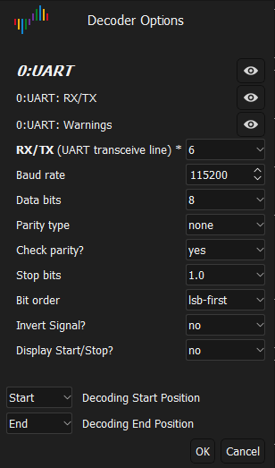

# Normal Boot - UART



```
U-Boot SPL 2017.11 (Aug 27 2024 - 13:23:06)
DRAM: 1024 MiB
Trying to boot from MMC2


DRAM:  1 GiB
MMC:   SUNXI SD/MMC: 0 SUNXI SD/MMC: 1
*** Warning - bad CRC using default environment

Setting up a 480x854 lcd console (overscan 0x0)
Video: Drawing the logo ...
Video: Call video_logo()
Video: splashimage #ERROR! 0x40000000
Video: Call splash_screen_prepare()
Video: Call splash_source_load() storage #ERROR! MMC
Video: splashsource #ERROR! mmc_fs
reading logo.bmp
In:    serial
Out:   serial
Err:   serial
Allwinner mUSB OTG (Peripheral)
Net:   
Warning: usb_ether using MAC address from ROM
eth0: usb_ether
starting USB...
USB0:   USB EHCI 1.00
USB1:   USB OHCI 1.0
scanning bus 0 for devices... 1 USB Device(s) found
       scanning usb for storage devices... 0 Storage Device(s) found
DEBUG: BootEnv bootdelay #ERROR! 0
DEBUG: Use fdt bootdelay #ERROR! 0
DEBUG: Actual bootdelay #ERROR! 0
DEBUG: Call autoboot_command() arg #ERROR! run distro_bootcmd
Hit any key to stop autoboot:  0 
switch to partitions #0 OK
mmc1(part 0) is current device
Scanning mmc 1:1...
Found U-Boot script /boot.scr
reading /boot.scr
586 bytes read in 18 ms (31.3 KiB/s)
## Executing script at 43100000
------------ x6200 boot script ------------
reading logo.bmp
25654 bytes read in 23 ms (1.1 MiB/s)
reading zImage
4956144 bytes read in 251 ms (18.8 MiB/s)
reading sun8i-r16-x6200.dtb
26472 bytes read in 25 ms (1 MiB/s)
## Flattened Device Tree blob at 49000000
   Booting using the fdt blob at 0x49000000
   Loading Device Tree to 49ff6000 end 49fff767 ... OK

Starting kernel ...

[    0.000000] Booting Linux on physical CPU 0x0
[    0.000000] Linux version 5.8.9 (jet@ubuntu) (arm-buildroot-linux-gnueabihf-gcc.br_real (Buildroot 2020.02.9) 8.4.0 GNU ld (GNU Binutils) 2.32) #116 SMP PREEMPT Sat Sep 21 11:59:57 HKT 2024
[    0.000000] CPU: ARMv7 Processor [410fc075] revision 5 (ARMv7) cr#ERROR!10c5387d
[    0.000000] CPU: div instructions available: patching division code
[    0.000000] CPU: PIPT / VIPT nonaliasing data cache VIPT aliasing instruction cache
[    0.000000] OF: fdt: Machine model: XIEGU Tech X6200 Transceiver
[    0.000000] Memory policy: Data cache writealloc
[    0.000000] Reserved memory: created CMA memory pool at 0x4a000000 size 128 MiB
[    0.000000] OF: reserved mem: initialized node cma@4a000000 compatible id shared-dma-pool
[    0.000000] Zone ranges:
[    0.000000]   Normal   [mem 0x0000000040000000-0x000000006fffffff]
[    0.000000]   HighMem  [mem 0x0000000070000000-0x000000007fffffff]
[    0.000000] Movable zone start for each node
[    0.000000] Early memory node ranges
[    0.000000]   node   0: [mem 0x0000000040000000-0x000000007fffffff]
[    0.000000] Initmem setup node 0 [mem 0x0000000040000000-0x000000007fffffff]
[    0.000000] psci: probing for conduit method from DT.
[    0.000000] psci: Using PSCI v0.1 Function IDs from DT
[    0.000000] percpu: Embedded 15 pages/cpu s30988 r8192 d22260 u61440
[    0.000000] Built 1 zonelists mobility grouping on.  Total pages: 260608
[    0.000000] Kernel command line: console#ERROR!ttyS0115200 root#ERROR!/dev/mmcblk1p2 rootwait panic#ERROR!10 fbcon#ERROR!rotate:3 
[    0.000000] video#ERROR!VGA:480x800 
[    0.000000] splashimage#ERROR!0x40000000 
[    0.000000] splashsource#ERROR!mmc_fs 
[    0.000000] splashpos#ERROR!mm
[    0.000000] Dentry cache hash table entries: 131072 (order: 7 524288 bytes linear)
[    0.000000] Inode-cache hash table entries: 65536 (order: 6 262144 bytes linear)
[    0.000000] mem auto-init: stack:off heap alloc:off heap free:off
[    0.000000] Memory: 895848K/1048576K available (7168K kernel code 526K rwdata 2072K rodata 1024K init 252K bss 21656K reserved 131072K cma-reserved 262132K highmem)
[    0.000000] SLUB: HWalign#ERROR!64 Order#ERROR!0-3 MinObjects#ERROR!0 CPUs#ERROR!4 Nodes#ERROR!1
[    0.000000] rcu: Preemptible hierarchical RCU implementation.
[    0.000000] rcu: RCU restricting CPUs from NR_CPUS#ERROR!8 to nr_cpu_ids#ERROR!4.
[    0.000000]      Trampoline variant of Tasks RCU enabled.
[    0.000000] rcu: RCU calculated value of scheduler-enlistment delay is 10 jiffies.
[    0.000000] rcu: Adjusting geometry for rcu_fanout_leaf#ERROR!16 nr_cpu_ids#ERROR!4
[    0.000000] NR_IRQS: 16 nr_irqs: 16 preallocated irqs: 16
[    0.000000] GIC: Using split EOI/Deactivate mode
[    0.000000] random: get_random_bytes called from start_kernel+0x324/0x4c0 with crng_init#ERROR!0
[    0.000000] arch_timer: cp15 timer(s) running at 24.00MHz (phys).
[    0.000000] clocksource: arch_sys_counter: mask: 0xffffffffffffff max_cycles: 0x588fe9dc0 max_idle_ns: 440795202592 ns
[    0.000007] sched_clock: 56 bits at 24MHz resolution 41ns wraps every 4398046511097ns
[    0.000020] Switching to timer-based delay loop resolution 41ns
[    0.000277] clocksource: timer: mask: 0xffffffff max_cycles: 0xffffffff max_idle_ns: 79635851949 ns
[    0.000772] Console: colour dummy device 80x30
[    0.000835] Calibrating delay loop (skipped) value calculated using timer frequency.. 48.00 BogoMIPS (lpj#ERROR!240000)
[    0.000849] pid_max: default: 32768 minimum: 301
[    0.001007] Mount-cache hash table entries: 2048 (order: 1 8192 bytes linear)
[    0.001028] Mountpoint-cache hash table entries: 2048 (order: 1 8192 bytes linear)
[    0.001898] CPU: Testing write buffer coherency: ok
[    0.002331] CPU0: update cpu_capacity 1024
[    0.002345] CPU0: thread -1 cpu 0 socket 0 mpidr 80000000
[    0.002985] Setting up static identity map for 0x40100000 - 0x40100060
[    0.003131] rcu: Hierarchical SRCU implementation.
[    0.003764] smp: Bringing up secondary CPUs ...
[    0.004736] CPU1: update cpu_capacity 1024
[    0.004744] CPU1: thread -1 cpu 1 socket 0 mpidr 80000001
[    0.005800] CPU2: update cpu_capacity 1024
[    0.005806] CPU2: thread -1 cpu 2 socket 0 mpidr 80000002
[    0.006766] CPU3: update cpu_capacity 1024
[    0.006772] CPU3: thread -1 cpu 3 socket 0 mpidr 80000003
[    0.006869] smp: Brought up 1 node 4 CPUs
[    0.006894] SMP: Total of 4 processors activated (192.00 BogoMIPS).
[    0.006901] CPU: All CPU(s) started in HYP mode.
[    0.006905] CPU: Virtualization extensions available.
[    0.007698] devtmpfs: initialized
[    0.014483] VFP support v0.3: implementor 41 architecture 2 part 30 variant 7 rev 5
[    0.014907] clocksource: jiffies: mask: 0xffffffff max_cycles: 0xffffffff max_idle_ns: 19112604462750000 ns
[    0.014935] futex hash table entries: 1024 (order: 4 65536 bytes linear)
[    0.019645] pinctrl core: initialized pinctrl subsystem
[    0.020555] thermal_sys: Registered thermal governor step_wise
[    0.021740] NET: Registered protocol family 16
[    0.023546] DMA: preallocated 256 KiB pool for atomic coherent allocations
[    0.024919] hw-breakpoint: found 5 (+1 reserved) breakpoint and 4 watchpoint registers.
[    0.024932] hw-breakpoint: maximum watchpoint size is 8 bytes.
[    0.047741] vgaarb: loaded
[    0.048222] SCSI subsystem initialized
[    0.048741] usbcore: registered new interface driver usbfs
[    0.048790] usbcore: registered new interface driver hub
[    0.048868] usbcore: registered new device driver usb
[    0.049086] mc: Linux media interface: v0.10
[    0.049121] videodev: Linux video capture interface: v2.00
[    0.049193] pps_core: LinuxPPS API ver. 1 registered
[    0.049200] pps_core: Software ver. 5.3.6 - Copyright 2005-2007 Rodolfo Giometti <giometti@linux.it>
[    0.049231] PTP clock support registered
[    0.049718] Advanced Linux Sound Architecture Driver Initialized.
[    0.050962] clocksource: Switched to clocksource arch_sys_counter
[    0.058968] NET: Registered protocol family 2
[    0.059580] tcp_listen_portaddr_hash hash table entries: 512 (order: 0 6144 bytes linear)
[    0.059612] TCP established hash table entries: 8192 (order: 3 32768 bytes linear)
[    0.059687] TCP bind hash table entries: 8192 (order: 4 65536 bytes linear)
[    0.059803] TCP: Hash tables configured (established 8192 bind 8192)
[    0.059980] UDP hash table entries: 512 (order: 2 16384 bytes linear)
[    0.060071] UDP-Lite hash table entries: 512 (order: 2 16384 bytes linear)
[    0.060450] NET: Registered protocol family 1
[    0.061214] RPC: Registered named UNIX socket transport module.
[    0.061226] RPC: Registered udp transport module.
[    0.061232] RPC: Registered tcp transport module.
[    0.061238] RPC: Registered tcp NFSv4.1 backchannel transport module.
[    0.061255] PCI: CLS 0 bytes default 64
[    0.063028] Initialise system trusted keyrings
[    0.063285] workingset: timestamp_bits#ERROR!30 max_order#ERROR!18 bucket_order#ERROR!0
[    0.069618] NFS: Registering the id_resolver key type
[    0.069670] Key type id_resolver registered
[    0.069677] Key type id_legacy registered
[    0.069791] Key type asymmetric registered
[    0.069800] Asymmetric key parser x509 registered
[    0.069852] bounce: pool size: 64 pages
[    0.069909] Block layer SCSI generic (bsg) driver version 0.4 loaded (major 247)
[    0.069920] io scheduler mq-deadline registered
[    0.069928] io scheduler kyber registered
[    0.075525] sun8i-a33-pinctrl 1c20800.pinctrl: initialized sunXi PIO driver
[    0.130320] Serial: 8250/16550 driver 8 ports IRQ sharing disabled
[    0.133603] printk: console [ttyS0] disabled
[    0.153842] 1c28000.serial: ttyS0 at MMIO 0x1c28000 (irq #ERROR! 34 base_baud #ERROR! 1500000) is a U6_16550A
[    0.834177] printk: console [ttyS0] enabled
[    0.859683] 1c28c00.serial: ttyS1 at MMIO 0x1c28c00 (irq #ERROR! 35 base_baud #ERROR! 1500000) is a U6_16550A
[    0.876291] lima 1c40000.gpu: gp - mali400 version major 1 minor 1
[    0.882621] lima 1c40000.gpu: pp0 - mali400 version major 1 minor 1
[    0.888939] lima 1c40000.gpu: pp1 - mali400 version major 1 minor 1
[    0.895259] lima 1c40000.gpu: l2 cache 64K 4-way 64byte cache line 64bit external bus
[    0.903839] lima 1c40000.gpu: bus rate #ERROR! 200000000
[    0.908629] lima 1c40000.gpu: mod rate #ERROR! 384000000
[    0.913562] lima 1c40000.gpu: dev_pm_opp_set_regulators: no regulator (mali) found: -19
[    0.921989] lima 1c40000.gpu: Failed to register cooling device
[    0.928362] [drm] Initialized lima 1.1.0 20191231 for 1c40000.gpu on minor 0
[    0.940315] libphy: Fixed MDIO Bus: probed
[    0.944804] CAN device driver interface
[    0.949515] ehci_hcd: USB 2.0 Enhanced Host Controller (EHCI) Driver
[    0.956108] ehci-pci: EHCI PCI platform driver
[    0.960634] ehci-platform: EHCI generic platform driver
[    0.966253] ohci_hcd: USB 1.1 Open Host Controller (OHCI) Driver
[    0.972497] ohci-pci: OHCI PCI platform driver
[    0.976982] ohci-platform: OHCI generic platform driver
[    0.986211] input: matrix_keypad@0 as /devices/platform/matrix_keypad@0/input/input0
[    0.995054] rotary-encoder rotary@0: gray
[    0.999729] input: rotary@0 as /devices/platform/rotary@0/input/input1
[    1.006583] rotary-encoder rotary@1: gray
[    1.011156] input: rotary@1 as /devices/platform/rotary@1/input/input2
[    1.017977] rotary-encoder rotary@2: gray
[    1.022498] input: rotary@2 as /devices/platform/rotary@2/input/input3
[    1.029309] rotary-encoder rotary@3: gray
[    1.033865] input: rotary@3 as /devices/platform/rotary@3/input/input4
[    1.041803] sun6i-rtc 1f00000.rtc: registered as rtc0
[    1.046857] sun6i-rtc 1f00000.rtc: RTC enabled
[    1.051681] i2c /dev entries driver
[    1.058228] sunxi-wdt 1c20ca0.watchdog: Watchdog enabled (timeout#ERROR!16 sec nowayout#ERROR!0)
[    1.070542] sun4i-ss 1c15000.crypto-engine: Die ID 5
[    1.077613] usbcore: registered new interface driver usbhid
[    1.083233] usbhid: USB HID core driver
[    1.090688] NET: Registered protocol family 17
[    1.095250] can: controller area network core (rev 20170425 abi 9)
[    1.101669] NET: Registered protocol family 29
[    1.106114] can: raw protocol (rev 20170425)
[    1.110378] can: broadcast manager protocol (rev 20170425 t)
[    1.116116] can: netlink gateway (rev 20190810) max_hops#ERROR!1
[    1.121897] Key type dns_resolver registered
[    1.126390] Registering SWP/SWPB emulation handler
[    1.131265] Loading compiled-in X.509 certificates
[    1.149592] sun8i-a23-r-pinctrl 1f02c00.pinctrl: initialized sunXi PIO driver
[    1.157109] sun8i-a23-r-pinctrl 1f02c00.pinctrl: supply vcc-pl not found using dummy regulator
[    1.187868] 1f02800.serial: ttyS2 at MMIO 0x1f02800 (irq #ERROR! 50 base_baud #ERROR! 1500000) is a U6_16550A
[    1.198652] panel@0 enforce active low on chipselect handle
[    1.209966] asoc-simple-card sound: sun8i <-> 1c22c00.dai mapping ok
[    1.218498] sunxi-rsb 1f03400.rsb: RSB running at 3000000 Hz
[    1.224698] axp20x-rsb sunxi-rsb-3a3: AXP20x variant AXP223 found
[    1.232900] input: axp20x-pek as /devices/platform/soc/1f03400.rsb/sunxi-rsb-3a3/axp221-pek/input/input5
[    1.244099] axp20x-adc axp22x-adc: DMA mask not set
[    1.249908] axp20x-battery-power-supply axp20x-battery-power-supply: DMA mask not set
[    1.258528] dcdc1: supplied by regulator-dummy
[    1.263132] vcc-3v0: Bringing 3300000uV into 3000000-3000000uV
[    1.269304] dcdc2: supplied by regulator-dummy
[    1.274615] dcdc3: supplied by regulator-dummy
[    1.279328] dcdc4: supplied by regulator-dummy
[    1.284081] dcdc5: supplied by regulator-dummy
[    1.288821] dc1sw: supplied by vcc-3v0
[    1.292861] dc5ldo: supplied by vcc-dram
[    1.297078] aldo1: supplied by regulator-dummy
[    1.301818] aldo2: supplied by regulator-dummy
[    1.306568] aldo3: supplied by regulator-dummy
[    1.311322] eldo1: supplied by vcc-3v0
[    1.315139] vcc-1v2-hsic: Bringing 700000uV into 1200000-1200000uV
[    1.321562] eldo2: supplied by vcc-3v0
[    1.325417] vcc-dsp: Bringing 700000uV into 3000000-3000000uV
[    1.331400] eldo3: supplied by vcc-3v0
[    1.335222] eldo3: Bringing 700000uV into 3000000-3000000uV
[    1.341047] dldo1: supplied by regulator-dummy
[    1.345557] vcc-wifi0: Bringing 700000uV into 3300000-3300000uV
[    1.351779] dldo2: supplied by regulator-dummy
[    1.356289] vcc-wifi1: Bringing 700000uV into 3300000-3300000uV
[    1.362500] dldo3: supplied by regulator-dummy
[    1.367011] vcc-3v0-csi: Bringing 700000uV into 3000000-3000000uV
[    1.373384] dldo4: supplied by regulator-dummy
[    1.378128] rtc_ldo: supplied by regulator-dummy
[    1.382983] ldo_io0: supplied by regulator-dummy
[    1.387913] ldo_io1: supplied by regulator-dummy
[    1.393478] axp20x-ac-power-supply axp20x-ac-power-supply: DMA mask not set
[    1.402103] axp20x-usb-power-supply axp20x-usb-power-supply: DMA mask not set
[    1.410297] axp20x-rsb sunxi-rsb-3a3: AXP20X driver loaded
[    1.417755] sun4i-drm display-engine: bound 1e00000.display-frontend (ops 0xc0853258)
[    1.426045] sun4i-drm display-engine: bound 1e60000.display-backend (ops 0xc0852a98)
[    1.433850] sun4i-drm display-engine: bound 1e70000.drc (ops 0xc08525c8)
[    1.441173] sun4i-drm display-engine: bound 1c0c000.lcd-controller (ops 0xc08515f8)
[    1.448828] [drm] Supports vblank timestamp caching Rev 2 (21.10.2013).
[    1.456525] [drm] Initialized sun4i-drm 1.0.0 20150629 for display-engine on minor 1
[    1.681651] Console: switching to colour frame buffer device 100x30
[    1.712884] sun4i-drm display-engine: fb0: sun4i-drmdrmfb frame buffer device
[    1.720804] ehci-platform 1c1a000.usb: EHCI Host Controller
[    1.726475] ehci-platform 1c1a000.usb: new USB bus registered assigned bus number 1
[    1.734659] ehci-platform 1c1a000.usb: irq 28 io mem 0x01c1a000
[    1.760973] ehci-platform 1c1a000.usb: USB 2.0 started EHCI 1.00
[    1.767314] usb usb1: New USB device found idVendor#ERROR!1d6b idProduct#ERROR!0002 bcdDevice#ERROR! 5.08
[    1.775595] usb usb1: New USB device strings: Mfr#ERROR!3 Product#ERROR!2 SerialNumber#ERROR!1
[    1.782839] usb usb1: Product: EHCI Host Controller
[    1.787712] usb usb1: Manufacturer: Linux 5.8.9 ehci_hcd
[    1.793032] usb usb1: SerialNumber: 1c1a000.usb
[    1.798279] hub 1-0:1.0: USB hub found
[    1.802099] hub 1-0:1.0: 1 port detected
[    1.806926] ohci-platform 1c1a400.usb: Generic Platform OHCI controller
[    1.813583] ohci-platform 1c1a400.usb: new USB bus registered assigned bus number 2
[    1.821647] ohci-platform 1c1a400.usb: irq 29 io mem 0x01c1a400
[    1.895140] usb usb2: New USB device found idVendor#ERROR!1d6b idProduct#ERROR!0001 bcdDevice#ERROR! 5.08
[    1.903432] usb usb2: New USB device strings: Mfr#ERROR!3 Product#ERROR!2 SerialNumber#ERROR!1
[    1.910646] usb usb2: Product: Generic Platform OHCI controller
[    1.916574] usb usb2: Manufacturer: Linux 5.8.9 ohci_hcd
[    1.921891] usb usb2: SerialNumber: 1c1a400.usb
[    1.927955] hub 2-0:1.0: USB hub found
[    1.931760] hub 2-0:1.0: 1 port detected
[    1.937668] sunxi-mmc 1c0f000.mmc: Got CD GPIO
[    1.967573] sunxi-mmc 1c0f000.mmc: initialized max. request size: 16384 KB
[    1.975985] sunxi-mmc 1c11000.mmc: allocated mmc-pwrseq
[    2.006615] sunxi-mmc 1c11000.mmc: initialized max. request size: 16384 KB
[    2.014048] ALSA device list:
[    2.017018]   #0: sun8i-a33-audio
[    2.021360] Waiting for root device /dev/mmcblk1p2...
[    2.108603] mmc1: new DDR MMC card at address 0001
[    2.114481] mmcblk1: mmc1:0001 8GTF4R 7.28 GiB 
[    2.119513] mmcblk1boot0: mmc1:0001 8GTF4R partition 1 4.00 MiB
[    2.126079] mmcblk1boot1: mmc1:0001 8GTF4R partition 2 4.00 MiB
[    2.134686]  mmcblk1: p1 p2
[    2.177841] EXT4-fs (mmcblk1p2): mounted filesystem with ordered data mode. Opts: (null)
[    2.186089] VFS: Mounted root (ext4 filesystem) readonly on device 179:2.
[    2.195724] devtmpfs: mounted
[    2.199982] Freeing unused kernel memory: 1024K
[    2.221200] Run /sbin/init as init process
[    2.247231] random: fast init done
[    2.304644] EXT4-fs (mmcblk1p2): re-mounted. Opts: (null)
Starting syslogd: OK
Starting klogd: OK
Running sysctl: OK
Populating /dev using udev: [    2.443013] udevd[119]: starting version 3.2.9
[    2.461867] random: udevd: uninitialized urandom read (16 bytes read)
[    2.469083] random: udevd: uninitialized urandom read (16 bytes read)
[    2.476621] random: udevd: uninitialized urandom read (16 bytes read)
[    2.509830] udevd[119]: specified group gpib unknown
[    2.519474] udevd[120]: starting eudev-3.2.9
[    2.740763] usb_phy_generic usb_phy_generic.1.auto: supply vcc not found using dummy regulator
[    2.773097] musb-hdrc musb-hdrc.2.auto: MUSB HDRC host driver
[    2.780822] musb-hdrc musb-hdrc.2.auto: new USB bus registered assigned bus number 3
[    2.794124] usb usb3: New USB device found idVendor#ERROR!1d6b idProduct#ERROR!0002 bcdDevice#ERROR! 5.08
[    2.797915] rtc rtc1: invalid alarm value: 2025-05-04T03:65:00
[    2.805332] usb usb3: New USB device strings: Mfr#ERROR!3 Product#ERROR!2 SerialNumber#ERROR!1
[    2.810636] rtc-pcf8563 1-0051: registered as rtc1
[    2.819720] usb usb3: Product: MUSB HDRC host driver
[    2.826543] usb usb3: Manufacturer: Linux 5.8.9 musb-hcd
[    2.834147] usb usb3: SerialNumber: musb-hdrc.2.auto
[    2.863188] rtc-pcf8563 1-0051: setting system clock to 2025-05-11T09:07:05 UTC (1746954425)
[    2.876534] hub 3-0:1.0: USB hub found
[    2.884234] hub 3-0:1.0: 1 port detected
[    2.888975] phy phy-1c19400.phy.1: External vbus detected not enabling our own vbus
done
Initializing random number generator: OK
Saving random seed: [    4.160455] urandom_read: 2 callbacks suppressed
[    4.160471] random: dd: uninitialized urandom read (512 bytes read)
OK
Starting haveged: haveged: listening socket at 3
OK
Starting system message bus: [    4.261406] random: dbus-uuidgen: uninitialized urandom read (12 bytes read)
[    4.268629] random: dbus-uuidgen: uninitialized urandom read (8 bytes read)
done
Starting network: OK
Starting NetworkManager ... done.
Starting sntp: sntp 4.2.8p15@1.3728-o Tue Aug 27 04:52:21 UTC 2024 (1)
pool.ntp.org lookup error Temporary failure in name resolution
FAIL
Starting ntpd: OK
Starting pulseaudio: W: [pulseaudio] main.c: [1B][1mRunning in system mode but --disallow-module-loading not set.[1B][0m
N: [pulseaudio] main.c: Running in system mode forcibly disabling SHM mode.
OK
[    6.052539] random: crng init done
[    6.055995] random: 2 urandom warning(s) missed due to ratelimiting
Starting sshd: OK
Init amixer: numid#ERROR!10iface#ERROR!MIXERname#ERROR!AIF1 Data Digital ADC Capture Switch
  ; type#ERROR!BOOLEANaccess#ERROR!rw------values#ERROR!2
  : values#ERROR!onon
numid#ERROR!19iface#ERROR!MIXERname#ERROR!Mic1 Capture Switch
  ; type#ERROR!BOOLEANaccess#ERROR!rw------values#ERROR!2
  : values#ERROR!onon
Simple mixer control ADC Gain0
  Capabilities: cvolume cvolume-joined
  Capture channels: Mono
  Limits: Capture 0 - 7
  Mono: Capture 7 [100%] [6.00dB]
Simple mixer control Mic1 Boost0
  Capabilities: volume volume-joined
  Playback channels: Mono
  Capture channels: Mono
  Limits: 0 - 7
  Mono: 1 [14%] [24.00dB]
Simple mixer control Mic10
  Capabilities: pvolume pvolume-joined pswitch cswitch
  Playback channels: Front Left - Front Right
  Capture channels: Front Left - Front Right
  Limits: Playback 0 - 7
  Front Left: Playback 1 [14%] [-3.00dB] [off] Capture [on]
  Front Right: Playback 1 [14%] [-3.00dB] [off] Capture [on]
Simple mixer control Mic10
  Capabilities: pvolume pvolume-joined pswitch cswitch
  Playback channels: Front Left - Front Right
  Capture channels: Front Left - Front Right
  Limits: Playback 0 - 7
  Front Left: Playback 1 [14%] [-3.00dB] [on] Capture [on]
  Front Right: Playback 1 [14%] [-3.00dB] [on] Capture [on]
numid#ERROR!9iface#ERROR!MIXERname#ERROR!AIF1 Slot 0 Digital DAC Playback Switch
  ; type#ERROR!BOOLEANaccess#ERROR!rw------values#ERROR!2
  : values#ERROR!onon
Simple mixer control DAC0
  Capabilities: pswitch
  Playback channels: Front Left - Front Right
  Mono:
  Front Left: Playback [on]
  Front Right: Playback [on]
Simple mixer control Headphone0
  Capabilities: pvolume pvolume-joined pswitch
  Playback channels: Front Left - Front Right
  Limits: Playback 0 - 63
  Mono:
  Front Left: Playback 1 [2%] [-62.00dB] [off]
  Front Right: Playback 1 [2%] [-62.00dB] [off]
Simple mixer control Headphone0
  Capabilities: pvolume pvolume-joined pswitch
  Playback channels: Front Left - Front Right
  Limits: Playback 0 - 63
  Mono:
  Front Left: Playback 1 [2%] [-62.00dB] [on]
  Front Right: Playback 1 [2%] [-62.00dB] [on]
 OK
Starting bluetooth
[    6.388712] Bluetooth: Core ver 2.22
[    6.393176] NET: Registered protocol family 31
[    6.397738] Bluetooth: HCI device and connection manager initialized
[    6.404287] Bluetooth: HCI socket layer initialized
[    6.409180] Bluetooth: L2CAP socket layer initialized
[    6.414329] Bluetooth: SCO socket layer initialized
adding SP serviece (first time)
Serial Port service registered
[    8.381422] Bluetooth: RFCOMM TTY layer initialized
Starting vsftpd: [    8.386374] Bluetooth: RFCOMM socket layer initialized
[    8.393100] Bluetooth: RFCOMM ver 1.11
OK
Starting monit: 
Starting Monit 5.26.0 daemon
OK


Welcome to XIEGU X6200!

XIEGU-x6200 login: [   25.119441] cfg80211: Loading compiled-in X.509 certificates for regulatory database
[   25.163191] cfg80211: Loaded X.509 cert sforshee: 00b28ddf47aef9cea7
```