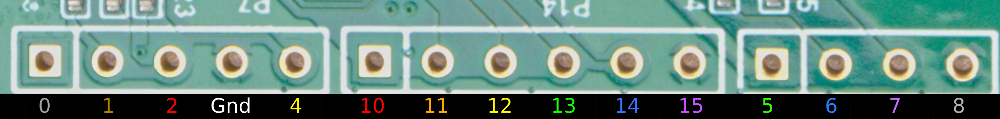

# Headers
Research into the 3 unknown headers on the display unit PCB.

## Pinout

## Software
[DSView v1.3.2](https://www.dreamsourcelab.com/software/DSView_v1.3.2_x64_setup.exe)

## Logic Files
### Normal Boot
[DSView](./Logic%20Files/NormalBoot.dsl)

[CSV](./Logic%20Files/NormalBoot.csv)

### Shutdown
[DSView](./Logic%20Files/Shutdown.dsl)

[CSV](./Logic%20Files/Shutdown.csv)